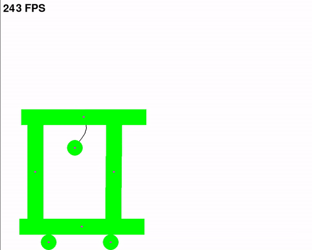

# ManiForce
> **ManiForce** — from Manifold + Force, with a nod to “many forces”: contact geometry turned into physical interaction.

## An experimental 2D rigid-body physics engine focused on contact dynamics.

The project focuses on implementing the underlying physics systems manually rather than relying on an existing physics engine.

*The engine is primarily an educational and experimental project and is still under active development.*

## Features



Currently implemented features include:

* 2D rigid-body dynamics
* Linear and angular motion
* Circle and *convex* polygon colliders
* SAT-based collision detection
* Penalty-based collision response
* Physically correct center of mass calculation for convex polygons
* Moment of inertia calculation for circles and polygons
* Joint system based on massive nodes connected by spring-damper elements
* In-Code + JSON-based scene redactor 
* Object templates and configuration presets
* Trajectory and debug visualization

> **Note:** The engine is currently experimental. Many systems are still being developed, redesigned, or replaced, and the current API should not be considered stable.

## Project Structure

```text
physical_engine/
├── physics/
│   ├── bodies.py        # Physical bodies and their properties
│   ├── collider.py      # Collider geometry and collision detection
│   ├── solver.py        # Collision and contact force calculations
│   ├── connections.py   # Joints and joint nodes
│   └── utils.py         # Vector class and utility functions
│
├── scenes_manager.py    # Scene management and serialization
├── materials.py         # Object configs and templates; future material system
├── settings.py          # Global simulation settings
└── main.py              # Main application loop
```

The current architecture is still evolving. Some modules, especially scene management, materials, and the collision solver, are expected to be reorganized as the engine grows.

## How It Works

### Collision Detection

Collisions between convex polygons are detected using the **Separating Axis Theorem (SAT)**.

For every relevant axis, both colliders are projected onto that axis. If the projections overlap on all tested axes, the objects are considered to be colliding.

The axis with the minimum overlap is used as the collision normal.

For polygon-polygon collisions, contact points are generated using reference and incident edges followed by clipping. Depending on the collision geometry, this can produce one or two contact points.

Circle and polygon collisions are handled separately according to their geometry.

### Collision Response

The engine currently uses a **penalty-force collision model**.

Instead of instantly correcting penetration using impulses, overlapping objects generate forces proportional to their deformation.

A simplified spring model is used:

```text
F = kx
```

where:

* `F` is the contact force,
* `k` is the effective stiffness,
* `x` is the penetration depth.

When two physical bodies collide, their stiffness values are combined into an effective contact stiffness.

Collision damping is calculated using the relative radial velocity at the contact point. Restitution is used to determine the damping ratio.

The resulting contact force therefore contains both:

```text
spring force + damping force
```

### Friction

Friction is calculated using the tangential component of the relative velocity at the contact point.

The contact-point velocity includes both linear and rotational motion:

```text
v_contact = v_linear + ω × r
```

This allows collisions and friction to affect both translational and rotational motion.

The friction force is currently based on a Coulomb-like model:

```text
F_friction = μN
```

where `μ` is the friction coefficient and `N` is the magnitude of the contact force.

For collisions between two physical objects, their friction coefficients are combined to obtain an effective coefficient for the contact.

A more complete material interaction system is planned.

### Rotation

Collision forces are applied at actual contact points rather than directly at the center of mass.

This produces torque:

```text
τ = r × F
```

where:

* `τ` is torque,
* `r` is the vector from the center of mass to the contact point,
* `F` is the applied collision force.

Angular acceleration is then calculated from:

```text
α = τ / I
```

where `I` is the body's moment of inertia.

For polygons, the center of mass and moment of inertia are calculated from the polygon geometry using triangle decomposition.

The local object origin and the physical center of mass are stored separately, allowing asymmetric polygons to rotate around their actual center of mass while preserving their original geometry.

### Joints

The current joint system represents connections as chains of massive nodes connected by spring-damper elements.

A joint can connect:

* a physical object to another physical object;
* a physical object to a fixed point.

Each connection behaves approximately like a Kelvin-Voigt spring-damper element, combining elastic and damping forces.

This makes it possible to construct systems such as:

* ropes;
* pendulums;
* flexible connections;
* multi-node chains.

The joint system is still experimental and is expected to gain additional behaviour and collision support in future versions.

---

### Installation Guide
0) Download Python 3.13+

1) Copy or download git-repo to any folder on your PC
2) In cmd write: "pip -m venv ./venv"
3) Then: pip install -r requirements.txt
4) Run from main.py

---
## Work in Progress (WIP)

ManiForce is currently in active development.

The project is still experimental, and both the public API and internal architecture may change significantly between versions. The roadmap below describes the current direction of development rather than a strict release schedule.

### Current Version — `0.2.x`

**Joints, serialization and architecture cleanup**

The current development branch focuses on expanding the engine beyond isolated rigid bodies and preparing the architecture for larger scenes.

Implemented or currently being refined:

* Joint system based on massive nodes and spring-damper connections
* PhysicalObject-to-PhysicalObject joints
* PhysicalObject-to-fixed-point joints
* Joint scene serialization
* JSON scene saving and loading
* Object templates and configuration presets
* Initial separation of scene definitions from reusable object configurations

Planned for the remaining `0.2.x` releases:

* Material abstraction
* Material-dependent density, stiffness, restitution and friction
* Material-to-material contact properties
* Material support for static obstacles
* Cleaner object identification and references
* Further cleanup of scene serialization

---

### `0.3.0` — Polygon System

**General polygon support and geometry improvements**

The main goal of `0.3.0` is to remove the current restriction to convex rigid bodies and make arbitrary polygonal geometry usable in the simulation.

Planned features:

* Concave polygon support
* Automatic decomposition into convex components
* Collision handling for compound polygon colliders
* Multiple contact manifolds between compound bodies
* Improved polygon mass and inertia calculations
* Cleaner separation between physical bodies and collider geometry

This version should make it possible to represent considerably more complex rigid-body shapes without manually splitting them into convex objects.

---

### `0.4.0` — Contact Solver

**Improved collision response and contact mechanics**

This version is planned as a major rework of the collision-response layer.

Planned areas of development:

* Refactoring of the current penalty-force solver
* Improved handling of multiple simultaneous contact points
* More stable resting contacts
* Better friction modelling
* Static and kinetic friction
* Improved restitution handling
* More consistent material interaction rules
* Better behaviour in constrained and stacked systems
* Reduction of numerical instability in high-stiffness contacts

The existing penalty-force approach may remain available for experimentation, while alternative contact-resolution methods may also be introduced.

---

### `0.5.0` — Numerical Simulation

**Integration, stability and simulation accuracy**

The goal of this release is to improve the numerical side of the engine.

Planned features and experiments:

* Alternative numerical integrators
* Replacement or extension of the current Euler integration
* Improved substep handling
* Better timestep stability
* Investigation of adaptive or semi-fixed simulation steps
* Improved energy behaviour
* More systematic simulation diagnostics
* Performance profiling of the physics loop

The focus of this version is not additional visible features, but making existing systems more stable and predictable.

---
## To be continued...
> More deatiled plan for versions until 1.0.0 may appear in future.   

`1.0.0` will mark the point where the core architecture is considered stable enough that major breaking changes should become significantly less frequent.

