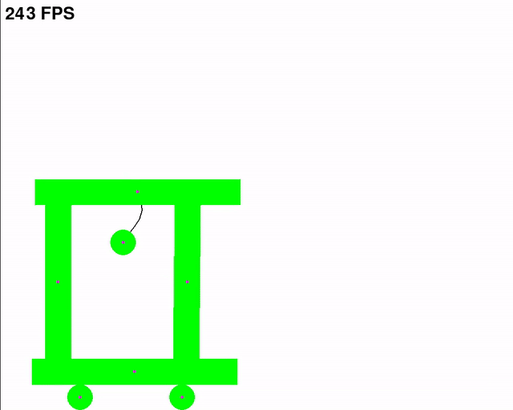

# ManiForce
> **ManiForce** — from Manifold + Force, with a nod to “many forces”: contact geometry turned into physical interaction.

## An experimental 2D rigid-body physics engine focused on contact dynamics.

The goal is to implement the underlying mechanics manually — collision detection, contact response, rigid-body dynamics, joints, numerical integration and simulation tooling — rather than relying on an existing physics engine.

The project is under active development. Internal architecture, numerical models and the public API are expected to change significantly before 1.0.0.

*The engine is primarily an educational and experimental project and is still under active development.*

## Features



Currently implemented features include:

* 2D rigid-body dynamics
* Linear and angular motion
* Circle and convex polygon colliders
* SAT-based collision detection
* Contact manifold generation for polygon collisions
* Penalty-force collision response
* Coulomb-like friction
* Restitution-dependent collision damping
* Physically calculated center of mass for polygons
* Moment of inertia calculation for circles and polygons
* Massive-node joint / rope system
* Spring-damper joint sectors
* Joint interaction with static obstacles
* Symplectic Euler integration
* Velocity Verlet integration
* Configurable physics substeps
* JSON-based scene serialization
* Object templates and configuration presets
* Physics state snapshots for rendering
* Experimental separation of physics and rendering into different processes
* Simulation benchmarking and parameter sweeps
* Performance and physics-error metrics
* PyTest-based unit and regression tests
* Trajectory and debug visualization

> **Note:** ManiForce is currently experimental. Numerical stability, APIs, serialization formats and internal architecture should not yet be considered stable.

---

## Project Structure

```text
maniforce/
├── physics/
│   ├── bodies.py          # Physical bodies, mass properties and force application
│   ├── collider.py        # Collider geometry and collision detection
│   ├── solver.py          # Collision/contact force calculations
│   ├── connections.py     # Joints, nodes, anchors and joint sectors
│   └── utils.py           # Vector math, states and numerical integrators
│
├── configs/
│   ├── scenes_manager.py  # Scene lifecycle, stepping, snapshots and serialization
│   ├── renderer.py        # Snapshot-based Pygame renderer
│   ├── materials.py       # Object configs and reusable presets
│   └── settings.py        # Global simulation settings
│
├── benchmarks/
│   └── benchmark.py       # Benchmark runner, metrics and parameter sweeps
│
├── tests/                 # PyTest unit and regression tests
├── assets/                # README/demo assets
├── main.py                # Application and experimental multiprocessing loop
└── requirements.txt
```

The architecture is still evolving. In particular, scene management, collision solving, joints, rendering and process synchronization are expected to be reorganized further.

---

# How It Works

## Collision Detection

Collisions between convex polygons are detected using the **Separating Axis Theorem (SAT)**.

For every relevant axis, both colliders are projected onto that axis. If the projections overlap on all tested axes, the objects are considered to be colliding.

The axis with the minimum overlap is used as the collision normal.

For polygon-polygon collisions, contact points are generated using reference and incident edges followed by clipping. Depending on the collision geometry, this can produce one or two contact points.

Circle and polygon collisions are handled separately according to their geometry.

---

## Collision Response

The engine currently uses a **penalty-force contact model**.

Instead of immediately removing penetration using impulses, overlapping objects generate a force proportional to their deformation:

```text
F = kx
```

where:

* `F` is the contact force;
* `k` is the effective contact stiffness;
* `x` is the penetration depth.

When two dynamic bodies collide, their stiffness values are combined into an effective contact stiffness.

Collision damping is calculated using the relative radial velocity at the contact point. Restitution is converted into a damping ratio and used to determine the damping coefficient.

The normal contact response therefore contains approximately:

```text
spring force + damping force
```

Forces are applied at the actual contact points, allowing collisions to produce both translation and rotation.

---

## Friction

Friction is calculated from the tangential component of the relative contact velocity.

Contact velocity includes both linear and rotational motion:

```text
v_contact = v_linear + ω × r
```

The relative velocity is separated into normal and tangential components.

The current friction model is Coulomb-like:

```text
F_friction = μN
```

where:

* `μ` is the effective friction coefficient;
* `N` is the magnitude of the normal contact force.

For collisions between dynamic bodies, friction coefficients are currently combined using their geometric mean.

The current model is intentionally simple. Static/kinetic friction separation and more complete material interaction rules are planned.

---

## Rotation

Collision and external forces may be applied at arbitrary points on a body.

A force applied away from the center of mass produces torque:

```text
τ = r × F
```

where:

* `τ` is torque;
* `r` is the vector from the center of mass to the application point;
* `F` is the applied force.

Angular acceleration is then calculated as:

```text
α = τ / I
```

where `I` is the moment of inertia.

For polygons, center of mass and moment of inertia are derived from the polygon geometry using triangle decomposition.

The graphical/local object origin and physical center of mass are stored separately, allowing asymmetric polygons to rotate around their actual center of mass while preserving their original local geometry.

---

## Numerical Integration

Simulation stepping is separated from the physical objects themselves through an integrator system.

Two integrators are currently implemented:

### Symplectic Euler

The Euler implementation updates velocity before position:

```text
vₙ₊₁ = vₙ + aₙ Δt
xₙ₊₁ = xₙ + vₙ₊₁ Δt
```

The same idea is applied to angular motion.

This method is inexpensive and useful as a baseline, but may introduce significant numerical energy error in oscillating or highly constrained systems.

### Velocity Verlet

Velocity Verlet is implemented as a split integration step.

Position is first advanced using the current acceleration:

```text
xₙ₊₁ = xₙ + vₙ Δt + ½aₙΔt²
```

Forces are then recalculated at the new state and velocity is updated using both accelerations:

```text
vₙ₊₁ = vₙ + ½(aₙ + aₙ₊₁)Δt
```

Angular motion is handled using the same principle.

This significantly improves energy behaviour in many conservative and oscillating test scenes.

### Substeps

Each physics step may be divided into multiple substeps.

This is particularly important for:

* stiff penalty contacts;
* spring-based joints;
* fast-moving objects;
* highly constrained systems.

Substeps improve stability and accuracy at the cost of additional computation.

---

## Joints

The current joint system represents flexible connections as chains of **massive nodes connected by spring-damper sectors**.

A joint can connect:

* a physical body to another physical body;
* a physical body to a fixed point.

Each sector behaves approximately like a Kelvin-Voigt element:

```text
F = kx + cv
```

where the damping term is calculated from relative velocity along the sector axis.

This allows the engine to model systems such as:

* ropes;
* pendulums;
* flexible connections;
* chains;
* multi-node deformable links.

Joint nodes have their own mass, velocity and acceleration and are processed by the selected numerical integrator.

The system also supports joint breaking through force limits.

Joint behaviour is currently one of the main areas of active development. Work is focused on making physical parameters less dependent on arbitrary node counts and making stiffness, damping and mass behave consistently as the rope is discretized into sectors.

---

## Benchmarking

ManiForce includes a simulation benchmark system designed to measure both performance and numerical error.

Available metrics currently include:

### Performance

* real execution time;
* simulated time;
* total steps;
* total substeps;
* average step time;
* real-time factor.

### Physics Error

* energy drift;
* minimum and maximum simulated energy;
* average trajectory error relative to a higher-resolution reference simulation;
* endpoint trajectory drift;
* average joint constraint error;
* maximum joint constraint error.

Benchmarks can perform parameter sweeps over values such as:

* integrator type;
* substep count;
* timestep;
* simulation length;
* reference simulation resolution.

Independent benchmark configurations can be executed in parallel using multiple processes.

This system is currently used to compare numerical integrators and investigate stability limits in joint and pendulum simulations.

---

## Physics / Rendering Separation

The current `0.4.x` development branch experiments with separating physics simulation from rendering.

Physics runs in a dedicated process and produces immutable scene snapshots containing only the data required for visualization.

The renderer consumes these snapshots independently.

Conceptually:

```text
Physics Process
      │
      │ SceneSnapshot
      ▼
 Snapshot Queue
      │
      ▼
Renderer / Main Process
```

The long-term goal is to make simulation speed independent from display refresh rate and prepare the engine for:

* configurable simulation playback speed;
* rendering interpolation;
* headless simulation;
* benchmarking without rendering;
* better utilization of multiple CPU cores.

The current multiprocessing implementation is still raw and requires substantial refactoring.

---

# Installation

Requires Python 3.13+.

Clone or download the repository, then create a virtual environment:

```bash
python -m venv .venv
```

Activate it and install dependencies:

```bash
pip install -r requirements.txt
```

Run:

```bash
python main.py
```

---

# Development Roadmap

ManiForce does not currently follow a strict release schedule.

Version numbers below describe the **current development direction**, not guaranteed feature boundaries. Features may move between versions as the architecture evolves.

---

## Current — `0.4.x`

### Simulation Architecture & Joint Stabilization

The current development stage is focused less on adding isolated features and more on restructuring the engine around a cleaner simulation pipeline.

Already implemented during the recent development cycle:

* PyTest unit and regression testing infrastructure
* Benchmark framework
* Performance metrics
* Physics error metrics
* Parallel benchmark sweeps
* Integrator abstraction
* Symplectic Euler integrator
* Velocity Verlet integrator
* Integrator support for rigid bodies and joint nodes
* Configurable simulation substeps
* Physics state snapshots
* Separation of rendering from live physics objects
* Experimental multiprocessing physics worker
* Snapshot queue between physics and rendering
* Independent renderer consuming simulation snapshots

Current work:

* Refactor the raw multiprocessing implementation
* Separate simulation time from rendering frequency
* Add controllable simulation/playback speed
* Introduce snapshot interpolation for rendering
* Restore and expand regression coverage after architectural changes
* Continue stabilization of spring-based joints
* Make joint discretization less dependent on manually selected node count
* Derive joint node mass from physical/geometrical parameters rather than arbitrary constants
* Make stiffness and damping behave consistently when sector length changes
* Improve joint collision behaviour
* Profile the current simulation architecture before further optimization

---

## `0.5.x` — Joint & Constraint System

### More Predictable Flexible Connections

The next major target is turning the current experimental rope implementation into a more general and predictable constraint system.

Possible development areas:

* Automatic joint discretization based on target sector length
* Density-based joint mass distribution
* Parameter scaling with sector length
* Better damping behaviour
* Stable high-stiffness joints
* Local-space body attachment points
* Better body-to-body joint anchors
* Joint-node collision improvements
* Joint self-collision experiments
* Better breaking and force-limit behaviour
* Additional joint types built on the same infrastructure
* Dedicated joint stability benchmarks

The objective is to make a joint's macroscopic behaviour depend primarily on its physical configuration rather than on how many internal nodes happen to represent it.

---

## `0.6.x` — Collision Geometry

### General Polygon and Compound Collider Support

The current rigid-body collider system is limited primarily to convex geometry.

Planned areas of development:

* Concave polygon support
* Automatic convex decomposition
* Compound colliders
* Multiple manifolds between compound bodies
* Cleaner separation between rigid-body state and collider geometry
* More robust contact generation
* Improved edge-case handling
* Collision regression scenes for difficult geometric configurations

A broad-phase collision system may also be introduced around this stage as scene complexity grows beyond the current brute-force pair checking approach.

Potential broad-phase approaches include:

* spatial grids;
* sweep-and-prune;
* bounding-volume hierarchies.

---

## `0.7.x` — Contact Solver & Materials

### More Complete Contact Mechanics

The current penalty-force solver works well as an experimental foundation but has known limitations, particularly for resting contacts, stacking and very stiff interactions.

Planned research and development:

* Refactor contact solving into a cleaner independent subsystem
* Improved simultaneous multi-contact handling
* More stable resting contacts
* Better stacked-body behaviour
* Static and kinetic friction
* Better friction limits at low tangential velocity
* Improved restitution handling
* Material abstraction
* Material-dependent density
* Material-dependent stiffness
* Material-dependent friction
* Material-dependent restitution
* Material-pair interaction rules
* Unified material behaviour for dynamic and static objects

Alternative contact resolution techniques may also be implemented experimentally.

The existing penalty-force model is expected to remain available because it is useful for continuous, compliant contact simulation.

Possible alternatives include:

* impulse-based response;
* sequential impulse solving;
* constraint-based contact solving.

---

## `0.8.x` — Performance

### Scaling Beyond Pure Python Hot Loops

Once the simulation architecture becomes sufficiently stable, optimization can become meaningful.

Planned areas:

* Systematic profiling
* Collision broad phase
* Reduction of unnecessary object allocations
* More efficient snapshots
* Faster collision manifold generation
* Faster joint calculations
* Improved multiprocessing architecture
* Investigation of native acceleration for computational hotspots

Performance-critical systems may eventually be moved outside pure Python.

Possible targets include:

* collision detection;
* manifold generation;
* joint calculations;
* constraint solving;
* vector-heavy inner loops.

Potential approaches include native C/C++ extensions or other compiled acceleration techniques while keeping the high-level engine API in Python.

---

## `0.9.x` — API, Tooling & Pre-1.0 Cleanup

The final pre-`1.0` development stage is expected to focus on turning the experimental codebase into a coherent engine rather than adding major new physics systems.

Potential goals:

* Stable module boundaries
* Cleaner public API
* Scene/configuration schema cleanup
* Improved serialization
* Migration/versioning strategy for saved scenes
* Better error handling
* Deterministic regression scenes
* Expanded automated tests
* Continuous integration cleanup
* Documentation
* Example scenes
* Headless simulation interface
* Improved debugging and visualization tools
* Packaging and easier installation

---

# `1.0.0`

`1.0.0` will not mean that ManiForce is a feature-complete general-purpose physics engine.

It will mark the point where the **core architecture and public concepts are considered stable enough** that major breaking redesigns should become substantially less frequent.

The intended core before `1.0` consists of:

* rigid-body dynamics;
* collision geometry;
* contact resolution;
* friction and restitution;
* numerical integration;
* joints and constraints;
* scene serialization;
* deterministic testing and benchmarking;
* independent simulation and rendering pipelines.

Everything beyond that can evolve incrementally without repeatedly rebuilding the foundation of the engine.
